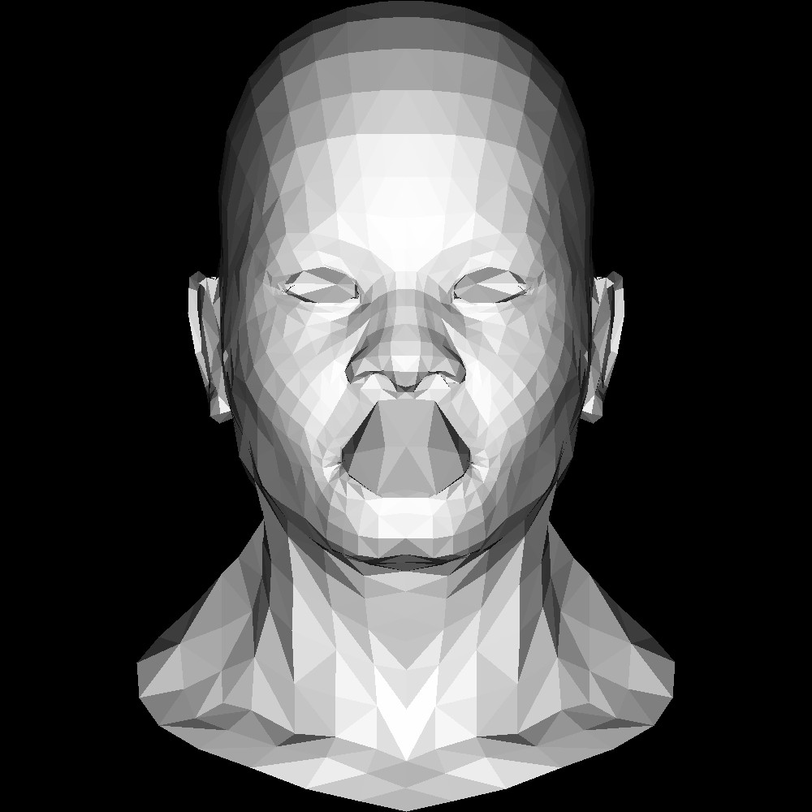
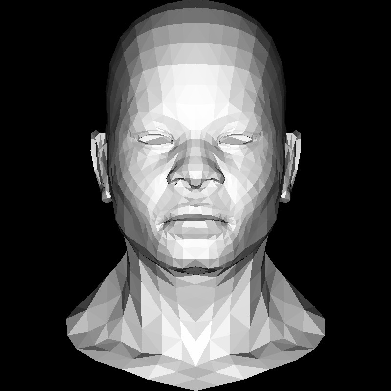
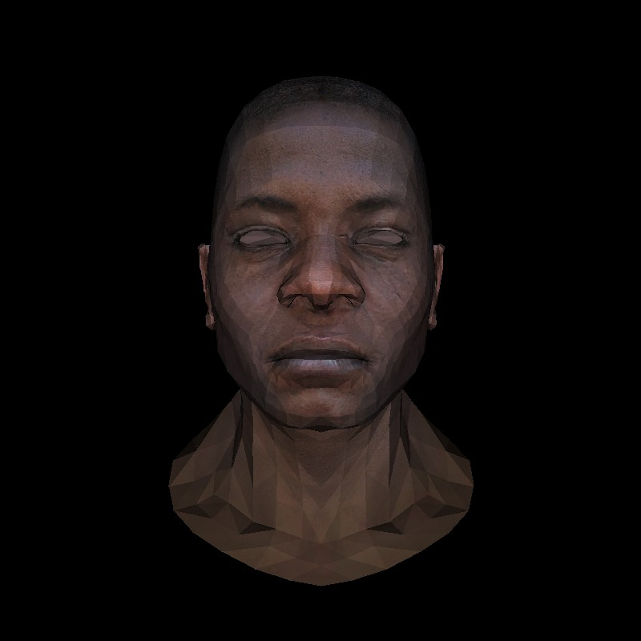
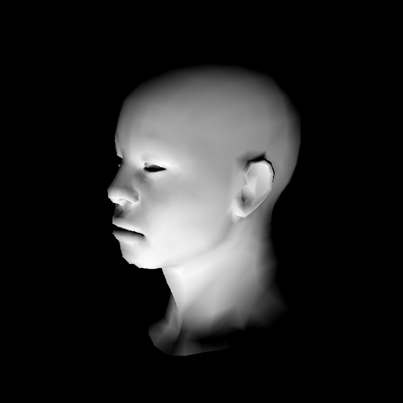
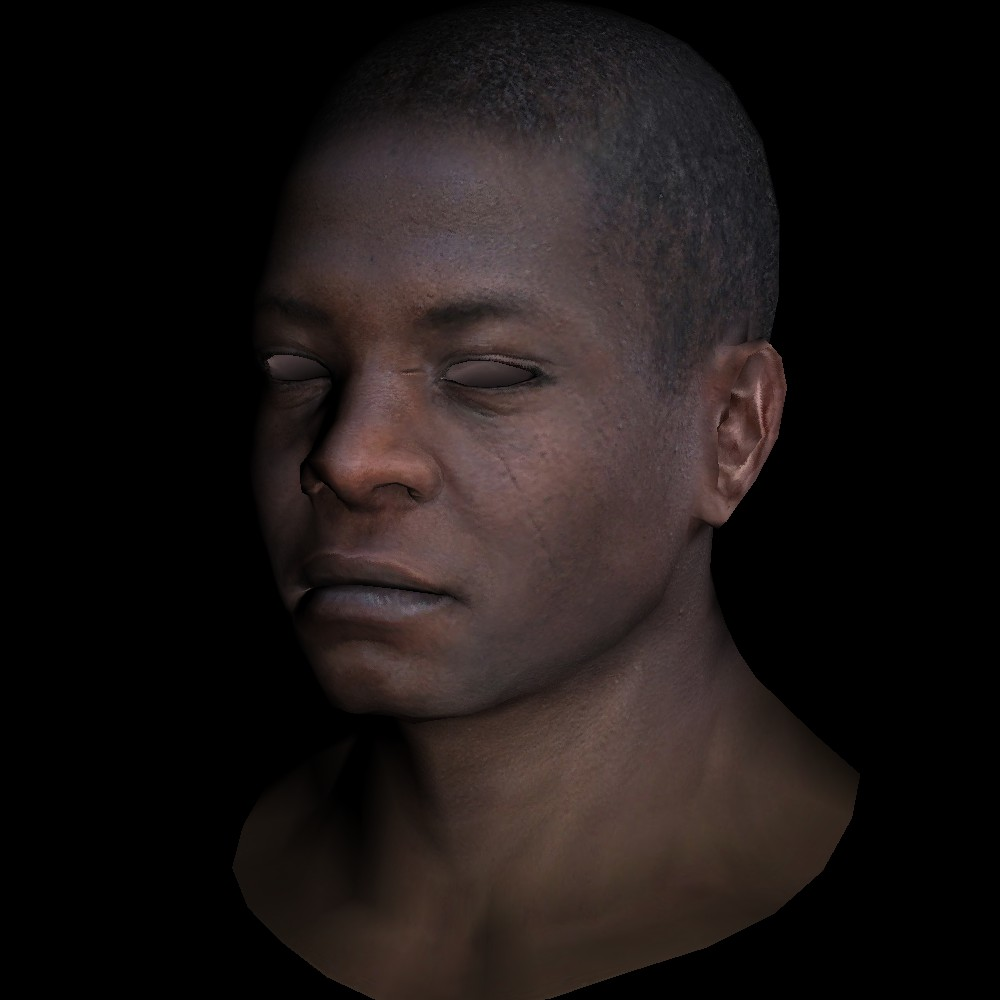

# 本项目为一个简单的光栅化渲染器

**简介**：本项目使用C++从头编写，未使用opengl和其他库，只从外部使用了模型读取及tga图片写入的函数

**参考**：[ssloy/tinyrenderer: A brief computer graphics / rendering course](https://github.com/ssloy/tinyrenderer)

​	    [从零构建光栅器，tinyrenderer笔记（上）](https://zhuanlan.zhihu.com/p/399056546)，[从零构建光栅器，tinyrenderer笔记（下）](https://zhuanlan.zhihu.com/p/400791821)

## Part 1 Line（画出模型线框）：

图1-1 模型线框

## Part 2 Triangle and Back face culling（模型着色）

图2-1 模型着色

## Part 3 Zbuffer（深度检测）	

图3-1 深度检测后

## Part 4 Perspective projection （透视矩阵,纹理映射）

图4-1 ZBuffer

图4-2 纹理映射

## Part 5 Moving the camera （移动相机）

图5-1 ZBuffer

图5-2 摄像机移动后

## Final 

